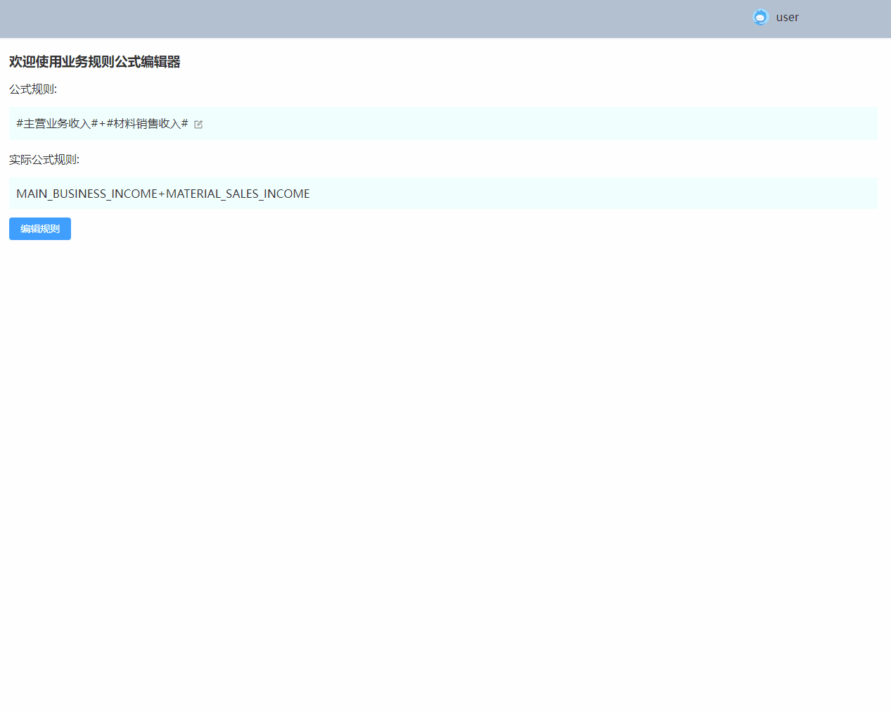
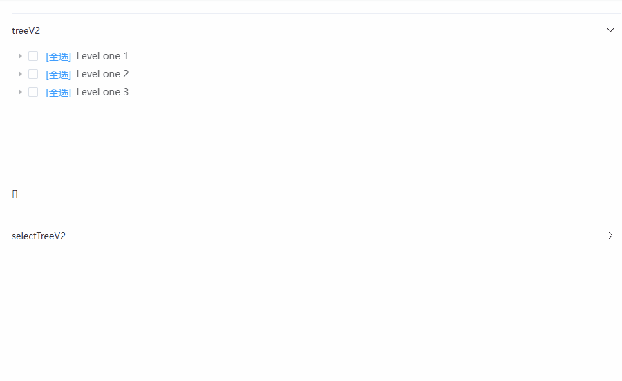

# Formula Rules Editor

> ## formula-rules-editor, base Tinymce Editor
> 
> ## if you feel nice this component, gave me a star, thanks！
> 
> template: Vite + Vue3 + Element-plus 

demo： https://ztrainwilliams.github.io/formula-rule-editor/

# 业务-公式规则编辑器

> ## formula-rules-editor, 基于Tinymce编辑器
> 
> ## 如果觉得这个组件不错的话，欢迎 Star 支持就好，感谢大家！
> 

## 树形show-checkbox模式下，单值、全选同时实现

在使用treeV2(虚拟树形组件，可自行调整未tree组件)，开启check-strictly，自定义全选功能实现

[demo](https://ztrainwilliams.github.io/formula-rule-editor/select-tree)

[组件treeV2](https://github.com/ZTrainWilliams/formula-rule-editor/tree/master/src/components/treeV2/index.vue)
[组件select-treeV2](https://github.com/ZTrainWilliams/formula-rule-editor/tree/master/src/components/select-treeV2/index.vue)

